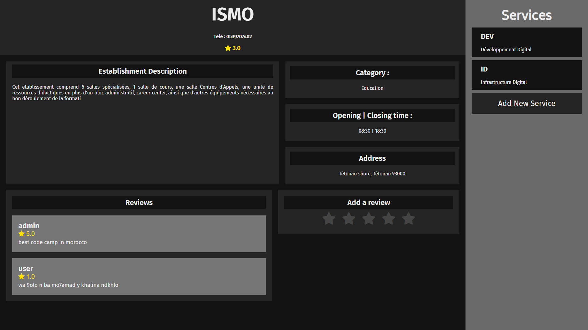

<h1>Système de Gestion d'Établissement</h1>

Bienvenue dans le référentiel du Système de Gestion d'Établissement ! Cette application web est conçue pour gérer efficacement les établissements et offrir une expérience utilisateur fluide. Elle s'adresse à deux types d'utilisateurs : les professionnels et les citoyens.

<h2>Technologies Utilisées</h2>

<ul>
  <li>PHP Natif : Constitue l'infrastructure de l'application web, gérant le script côté serveur, la logique de l'application, le traitement des données et les interactions avec la base de données.</li>
  <li>JavaScript : Ajoute de l'interactivité et de la dynamique à l'application, permettant les mises à jour en temps réel, les validations de formulaires et les interfaces utilisateur dynamiques.</li>
  <li>HTML : Fournit la structure de base des pages web, fonctionnant en collaboration avec PHP pour générer dynamiquement du contenu.</li>
  <li>CSS : Responsable de la présentation visuelle et du style de l'application, assurant une interface cohérente et esthétiquement plaisante.</li>
</ul>

<h2>Fonctionnalités</h2>

<ol>
  <li>Inscription des Utilisateurs : Les professionnels et les citoyens peuvent s'inscrire sur la plateforme pour accéder à ses fonctionnalités.</li>
  <li>Gestion des Établissements Professionnels : Les professionnels peuvent créer des profils pour leurs établissements au sein du système, fournissant des informations de contact, l'adresse et une brève description.</li>
  <li>Gestion des Services : Les professionnels peuvent ajouter plusieurs services offerts par leurs établissements, comprenant des détails tels que des descriptions, des prix et des durées.</li>
  <li>Système de Commentaires : Les citoyens et les professionnels peuvent contribuer au système en ajoutant des commentaires sur les établissements, partageant ainsi leurs expériences et opinions.</li>
  <li>Filtrage par Catégorie : L'application propose une liste de tous les établissements, avec la possibilité de filtrer par différentes catégories telles que Santé, Éducation, Hébergement, Professionnel et Personnel.</li>
</ol>

<h2>Défis Rencontrés</h2>

Lors du développement de cette application, nous avons été confrontés à plusieurs défis qui ont influencé notre travail. Ces défis comprenaient :

<ol>
  <li>Mauvaise Planification : Une planification insuffisante a entraîné des retards dans les tâches, une mauvaise allocation des ressources et des estimations de délais inexactes, affectant ainsi la progression du projet.</li>
  <li>Manque de Travail d'Équipe : Une collaboration insuffisante, des différences d'opinions, des lacunes de communication et des problèmes de coordination ont entravé notre efficacité collective.</li>
  <li>Pression des Examens : L'équilibre entre les responsabilités académiques et les tâches de développement a ajouté une pression mentale supplémentaire et une répartition inégale des efforts.</li>
  <li>Délais Serrés : Les échéances rapprochées ont limité le temps disponible pour le développement, les tests et les ajustements, mettant ainsi une pression supplémentaire sur l'équipe.</li>
  <li>Limitations Techniques et Ressources Limitées : Des contraintes techniques, des ressources limitées et des exigences changeantes ont ajouté à la complexité du projet.</li>
</ol>

    

    

    

    

    

    

    

    

    

    

    

<h2>Prochaines Étapes</h2>

Malgré les difficultés rencontrées, nous avons réussi à surmonter les obstacles grâce à notre résilience et notre adaptabilité. À l'avenir, nous avons l'intention de :

<ul>
  <li>Améliorer l'Application : Nous continuerons à développer le système en utilisant les dernières technologies et en écoutant les commentaires des utilisateurs pour améliorer les fonctionnalités et l'expérience utilisateur.</li>
  <li>Expansion du Projet : Nous envisageons de transformer ce projet en une startup, en participant à des compétitions et en explorant des opportunités de croissance et d'investissement.</li>
  <li>Établir des Partenariats : Nous chercherons à établir des partenariats stratégiques avec d'autres entreprises du secteur pour renforcer notre position sur le marché et élargir notre portée.</li>
  <li>Marketing et Promotion : Nous mettrons en œuvre des stratégies de marketing efficaces pour promouvoir notre application, atteindre un large public et acquérir des utilisateurs.</li>
  <li>Support Client et Améliorations : Nous fournirons un support client de qualité et continuerons à mettre à jour et améliorer l'application en fonction des besoins des utilisateurs.</li>
</ul>

<h2>Contributions</h2>

Si vous souhaitez contribuer à ce projet, vous pouvez :

<ul>
  <li>Cloner ce référentiel et proposer des améliorations en créant une nouvelle branche de développement.</li>
  <li>Signaler des problèmes ou des bogues en ouvrant une nouvelle issue.</li>
  <li>Proposer des suggestions ou des fonctionnalités supplémentaires en ajoutant des commentaires dans les discussions du référentiel.</li>
</ul>

Nous vous remercions de l'intérêt que vous portez à notre projet et nous sommes impatients de collaborer avec vous pour faire avancer cette application de gestion d'établissement.

